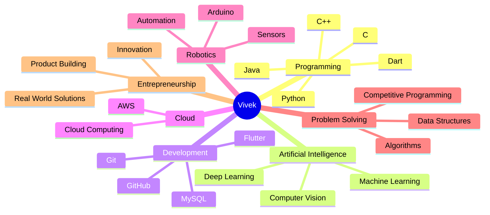

<!-- ========================================================= -->

<!--                    VIVEK GITHUB PROFILE                   -->

<!-- ========================================================= -->

<!-- ======================= HERO ============================ -->

<div align="center">


<br><br>


<br>


</div>

---

# 👋 Hello, I'm Vivek

<div align="center">

### `Computer Science Student` • `AI/ML Enthusiast` • `Developer` • `Entrepreneur`

</div>

I'm a Computer Science student passionate about **Artificial Intelligence, Machine Learning, Robotics, Software Development and Cloud Computing**.

I enjoy transforming ideas into practical solutions and continuously improving my skills through **projects, problem solving and experimentation**.

```text
╔══════════════════════════════════════════════════════════╗
║                    DEVELOPER PROFILE                     ║
╠══════════════════════════════════════════════════════════╣
║                                                          ║
║  🎓  Computer Science Student                            ║
║  🤖  AI / ML Enthusiast                                  ║
║  💻  Software Developer                                  ║
║  🦾  Robotics Explorer                                   ║
║  ☁️  Cloud Computing Learner                             ║
║  🧩  DSA & Problem Solving                               ║
║  🚀  Technology & Entrepreneurship                       ║
║                                                          ║
╚══════════════════════════════════════════════════════════╝
```

---

# 🧑‍💻 ABOUT ME

<table>
<tr>

<td width="55%">

### 🚀 Who I Am

* 🎓 Computer Science student at **VIT-AP University**
* 🤖 Exploring **AI & Machine Learning**
* 💻 Developing with **Java, Python, C/C++ and Dart**
* 🧩 Practicing **Data Structures & Algorithms**
* ☁️ Learning **AWS & Cloud Computing**
* 📱 Building applications using **Flutter**
* 🦾 Interested in **Robotics & Computer Vision**
* 🚀 Interested in **Innovation & Entrepreneurship**

### 🎯 My Mission

> **Learn technology. Build solutions. Solve real problems. Create impact.**

</td>

<td width="45%" align="center">


<br><br>


</td>

</tr>
</table>

---

# ⚡ TECHNOLOGY ARSENAL

<div align="center">

## 💻 Programming Languages


<br><br>

## 🤖 AI • ML • Computer Vision


<br><br>


<br><br>

## ☁️ Cloud • Development • Tools


</div>

---

# 🚀 FEATURED PROJECTS

<table>
<tr>

<td width="33%" align="center">

## 🤖 DustEvo Rover


### Autonomous Waste Collection

AI-powered robotic rover designed for intelligent waste detection, collection and segregation.

**Core Technologies**

`AI` `Computer Vision`
`Robotics` `Sensors`
`Arduino` `Automation`

♻️ **Smart Waste Management**

</td>

<td width="33%" align="center">

## 💊 DosePulse


### Smart Medicine Scheduler

Mobile application designed to manage medicines, schedules, reminders and notifications.

**Core Technologies**

`Flutter` `Dart`
`Notifications`
`Local Storage`

📱 **Smart Scheduling**

</td>

<td width="33%" align="center">

## 🛣️ Road Safety AI


### Intelligent Road Monitoring

Deep-learning and computer-vision based approach for intelligent road-safety monitoring.

**Core Technologies**

`Deep Learning`
`Computer Vision`
`OpenCV` `AI`

⚠️ **Intelligent Safety**

</td>

</tr>
</table>

---

# 🧠 KNOWLEDGE MAP



---

# 📚 LEARNING ROADMAP

<div align="center">

```text
                   🧑‍💻 PROGRAMMING
                         │
                         ▼
                🧩 DATA STRUCTURES
                         │
                         ▼
                  ⚡ ALGORITHMS
                         │
              ┌──────────┼──────────┐
              ▼          ▼          ▼
             🤖         💻         ☁️
            AI/ML      SOFTWARE     AWS
              │          │          │
              ▼          ▼          ▼
        🧠 DEEP ML    📱 FLUTTER   🌐 CLOUD
              │          │          │
              └──────────┼──────────┘
                         ▼
                  🚀 PRODUCT BUILDING
                         │
                         ▼
                     🌎 IMPACT
```

</div>

---

# 🔥 WHAT I'M CURRENTLY WORKING ON

<table>

<tr>
<td>🧩</td>
<td><b>Data Structures & Algorithms</b></td>
<td>Improving problem-solving skills with Java</td>
</tr>

<tr>
<td>🤖</td>
<td><b>Artificial Intelligence</b></td>
<td>Building practical AI/ML projects</td>
</tr>

<tr>
<td>🧠</td>
<td><b>Deep Learning</b></td>
<td>Exploring neural networks and computer vision</td>
</tr>

<tr>
<td>☁️</td>
<td><b>AWS</b></td>
<td>Learning cloud infrastructure and services</td>
</tr>

<tr>
<td>📱</td>
<td><b>Flutter</b></td>
<td>Building useful mobile applications</td>
</tr>

<tr>
<td>🚀</td>
<td><b>Innovation</b></td>
<td>Turning ideas into technology products</td>
</tr>

</table>

---

# 📊 GITHUB COMMAND CENTER

<div align="center">


</div>

---

# 🔥 CONTRIBUTION STREAK

<div align="center">


</div>

---

# 📈 CONTRIBUTION ACTIVITY

<div align="center">


</div>

---

# 🐍 GITHUB CONTRIBUTION SNAKE

<div align="center">


</div>

---

# 🏆 GITHUB TROPHIES

<div align="center">


</div>

---

# 🧩 PROBLEM SOLVING MINDSET

<div align="center">

```text
                 ┌───────────────┐
                 │    PROBLEM    │
                 └───────┬───────┘
                         ↓
                 ┌───────────────┐
                 │   UNDERSTAND  │
                 └───────┬───────┘
                         ↓
                 ┌───────────────┐
                 │    ANALYZE    │
                 └───────┬───────┘
                         ↓
                 ┌───────────────┐
                 │    DESIGN     │
                 └───────┬───────┘
                         ↓
                 ┌───────────────┐
                 │     CODE      │
                 └───────┬───────┘
                         ↓
                 ┌───────────────┐
                 │     TEST      │
                 └───────┬───────┘
                         ↓
                 ┌───────────────┐
                 │   OPTIMIZE    │
                 └───────┬───────┘
                         ↓
                 ┌───────────────┐
                 │    SOLVED 🚀  │
                 └───────────────┘
```

</div>

---

# 🛠️ DEVELOPMENT PHILOSOPHY

<table>
<tr>

<td align="center" width="25%">

### 🧠

**LEARN**

Understand before building.

</td>

<td align="center" width="25%">

### 💻

**BUILD**

Turn knowledge into projects.

</td>

<td align="center" width="25%">

### 🧪

**EXPERIMENT**

Try. Fail. Improve.

</td>

<td align="center" width="25%">

### 🚀

**INNOVATE**

Create meaningful solutions.

</td>

</tr>
</table>

---

# 🌌 BEYOND CODE

<div align="center">

```text
╔══════════════════════════════════════════════════════╗
║                                                      ║
║       LEARN       →       BUILD       →       IMPACT  ║
║                                                      ║
║          Ideas are easy. Execution is everything.    ║
║                                                      ║
╚══════════════════════════════════════════════════════╝
```

</div>

---

# 💭 DEVELOPER PHILOSOPHY

<div align="center">


<br><br>

### 🚀 `Build. Break. Learn. Improve. Repeat.`

</div>

---

# 🎯 2026 GOALS

```text
╭──────────────────────────────────────────────────────╮
│                                                      │
│  [✓] Strengthen Programming Fundamentals             │
│                                                      │
│  [→] Master Data Structures & Algorithms              │
│                                                      │
│  [→] Build Advanced AI / ML Projects                 │
│                                                      │
│  [→] Explore Deep Learning & Computer Vision         │
│                                                      │
│  [→] Become Proficient in AWS                        │
│                                                      │
│  [→] Build Production-Ready Applications             │
│                                                      │
│  [→] Create Innovative Technology Products            │
│                                                      │
╰──────────────────────────────────────────────────────╯
```

---

# 🌐 CONNECT WITH ME

<div align="center">

<a href="https://github.com/YOUR_USERNAME">


</a>

<a href="https://www.linkedin.com/in/YOUR_LINKEDIN_USERNAME/">


</a>

</div>

---

# ⭐ SUPPORT

<div align="center">

If you find my projects interesting, consider giving them a ⭐

<br>

**Every star motivates me to build more! 🚀**

</div>

---

<div align="center">


<br><br>


</div>
